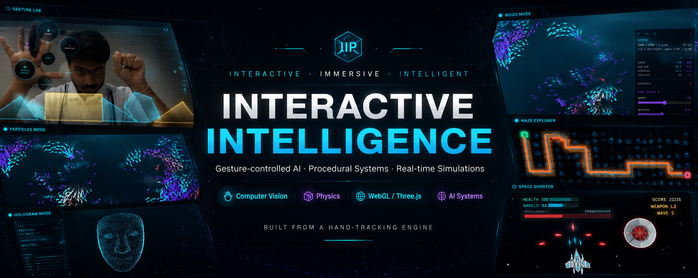
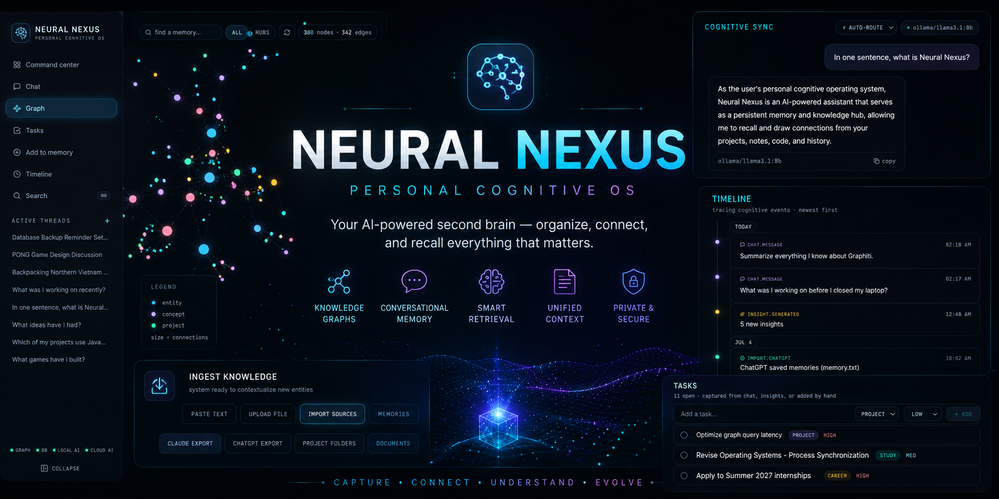

# Dev Agrawal

**Software Engineer** — Full Stack Development · Interactive Systems · AI-Powered Applications

  

## About

I build software that does real work under the hood — interfaces that stay responsive under load, backends that model data the way the problem actually shapes it, and rendering pipelines that stay smooth when a lot is happening on screen at once.

Most of what I build sits between web engineering, computer graphics, and AI-backed systems, with an ongoing focus on architecture, performance, and how good the resulting codebase is to work in.

 

**Current Focus**

- AI memory systems and knowledge-graph-based retrieval
- Interactive browser graphics and real-time rendering
- System design for scalable web applications
- Full-stack application architecture

  

---

## Tech Stack

**Languages**
 
<picture>
  <source media="(prefers-color-scheme: dark)" srcset="https://skillicons.dev/icons?i=ts,js,py,cpp&theme=dark">
  <source media="(prefers-color-scheme: light)" srcset="https://skillicons.dev/icons?i=ts,js,py,cpp&theme=light">
  
</picture>

  

**Frontend**
 
<picture>
  <source media="(prefers-color-scheme: dark)" srcset="https://skillicons.dev/icons?i=react,vite,tailwind,html,css&theme=dark">
  <source media="(prefers-color-scheme: light)" srcset="https://skillicons.dev/icons?i=react,vite,tailwind,html,css&theme=light">
  
</picture>

  

**Backend**
 
<picture>
  <source media="(prefers-color-scheme: dark)" srcset="https://skillicons.dev/icons?i=fastapi&theme=dark">
  <source media="(prefers-color-scheme: light)" srcset="https://skillicons.dev/icons?i=fastapi&theme=light">
  
</picture>
 
Also: REST API design, SQLAlchemy

  

**Graphics & AI**
 
<picture>
  <source media="(prefers-color-scheme: dark)" srcset="https://skillicons.dev/icons?i=threejs&theme=dark">
  <source media="(prefers-color-scheme: light)" srcset="https://skillicons.dev/icons?i=threejs&theme=light">
  
</picture>
 
Also: WebGL · MediaPipe (Computer Vision) · Retrieval-Augmented Generation

  

**Databases**
 
<picture>
  <source media="(prefers-color-scheme: dark)" srcset="https://skillicons.dev/icons?i=postgres&theme=dark">
  <source media="(prefers-color-scheme: light)" srcset="https://skillicons.dev/icons?i=postgres&theme=light">
  
</picture>
 
Also: Neo4j (Graph Database)

  

**Tools**
 
<picture>
  <source media="(prefers-color-scheme: dark)" srcset="https://skillicons.dev/icons?i=git,github,docker,linux,vscode,postman&theme=dark">
  <source media="(prefers-color-scheme: light)" srcset="https://skillicons.dev/icons?i=git,github,docker,linux,vscode,postman&theme=light">
  
</picture>

  

---

## Featured Projects

<!-- Replace assets/iip-banner.png and assets/neural-nexus-banner.png with real project screenshots -->

<table>
<tr>
<td width="100%">

### Interactive Intelligence Platform

A persistent, browser-native platform combining computer graphics, computer vision, and physics simulation into a single interactive system.

**Architecture:** Single-page application in React and TypeScript, structured around a component-based hierarchy spanning 10+ interactive modules. A shared rendering pipeline (React Three Fiber / WebGL) and centralized state management keep the codebase modular, so new modules plug in without touching core rendering logic.

**Highlights**
- Reusable UI component library powering navigation, HUDs, and control panels across every module
- Browser-native Web API integration (MediaPipe hand tracking) with optimized render loops and lazy-loaded modules
- Computational Arcade: algorithm-visualization tools and browser games sharing a unified leaderboard service

**Tech:** React · TypeScript · Three.js · React Three Fiber · MediaPipe

[Live Demo →](https://interactive-ai-platform.vercel.app) · [Source →](https://github.com/Dev4522agrawal/interactive-ai-platform)

</td>
</tr>
</table>

 

<table>
<tr>
<td width="100%">

### Neural Nexus

A personal AI memory engine that organizes conversations, documents, and project data into a continuously evolving knowledge graph.

**Architecture:** FastAPI backend with a REST API layer backed by PostgreSQL and Neo4j — PostgreSQL for structured data, Neo4j for relationship and graph queries. Backend is split into decoupled ingestion, graph-management, and retrieval layers so each can be scaled or replaced independently. Retrieval-Augmented Generation is exposed through a single API that orchestrates multiple local and cloud language models.

**Highlights**
- Structured, API-driven data layer replacing ad-hoc context storage
- Graph queries and relational modeling working together for semantic retrieval
- Multi-model orchestration behind one unified retrieval endpoint
- Fully containerized service stack for reproducible local deployment

**Tech:** FastAPI · PostgreSQL · Neo4j · Docker

[Source →](https://github.com/Dev4522agrawal/Neural-Nexus)

</td>
</tr>
</table>

  

---

## What I Work With

- Software Engineering & Full Stack Development
- AI Systems & System Design
- Computer Graphics & Interactive Experiences
- Developer Tools & Performance Optimization
- Distributed Systems

  

---

## GitHub Stats

  

  
## Contribution Activity

<picture>
  <source media="(prefers-color-scheme: dark)" srcset="https://github-readme-activity-graph.vercel.app/graph?username=Dev4522agrawal&theme=github-dark&hide_border=true&bg_color=00000000">
  <source media="(prefers-color-scheme: light)" srcset="https://github-readme-activity-graph.vercel.app/graph?username=Dev4522agrawal&theme=github&hide_border=true&bg_color=00000000">
  
</picture>

  

---

---

[Portfolio](https://interactive-ai-platform.vercel.app) · [Resume](assets/resume.pdf) · [LinkedIn](https://linkedin.com/in/dev4522agrawal) · [Email](mailto:dev4522agrawal@gmail.com)

