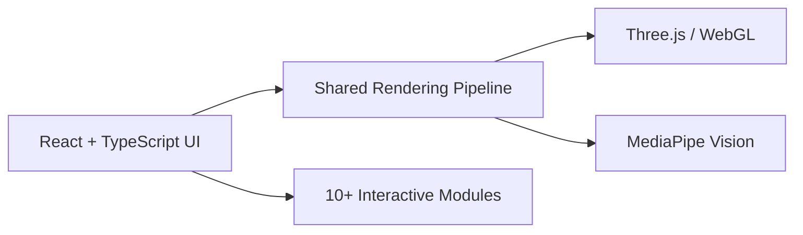

# Dev Agrawal

**Software Engineer** — Full Stack Development · Interactive Systems · AI-Powered Applications

 

## About

I build software across the full stack — from React-based interfaces and real-time rendering pipelines to FastAPI backends and graph-based data systems. My work sits at the intersection of **web engineering**, **computer graphics**, and **AI-powered applications**, with a focus on system design, performance, and developer experience.

> Focused on shipping well-architected systems — from browser-native rendering pipelines to production-grade backend APIs.

 

## Tech Stack

**Languages**
 

**Frontend**
 

**Backend**
 

**Graphics**
 

**AI**
 

**Database**
 

**Tools**
 

 

---

## Featured Projects

### Interactive Intelligence Platform

A persistent, browser-native platform combining computer graphics, computer vision, and physics simulation into a single interactive system — architected around a component-based React frontend and a shared, reusable rendering pipeline.

**Modules:** Gesture Lab · Maze Explorer · Space Shooter · Particle Systems · Computer Vision · Interactive Simulations

 

### Neural Nexus

A personal AI memory engine that transforms conversations, documents, and project data into a continuously evolving knowledge graph — built on a FastAPI backend with PostgreSQL and Neo4j powering structured and graph-based retrieval.

**Highlights:** Knowledge Graphs · Semantic Retrieval · AI Memory · Modern Backend Architecture

 

---

## What I Work With

| | |
|---|---|
| Software Engineering | Full Stack Development |
| AI Systems | System Design |
| Computer Graphics | Developer Tools |
| Performance Optimization | Distributed Systems |

 

---

## GitHub Stats

<picture>
  <source media="(prefers-color-scheme: dark)" srcset="https://github-readme-stats.vercel.app/api?username=Dev4522agrawal&show_icons=true&theme=dark&hide_border=true&bg_color=00000000">
  <source media="(prefers-color-scheme: light)" srcset="https://github-readme-stats.vercel.app/api?username=Dev4522agrawal&show_icons=true&theme=default&hide_border=true&bg_color=00000000">
  
</picture>

<picture>
  <source media="(prefers-color-scheme: dark)" srcset="https://github-readme-stats.vercel.app/api/top-langs/?username=Dev4522agrawal&layout=compact&theme=dark&hide_border=true&bg_color=00000000">
  <source media="(prefers-color-scheme: light)" srcset="https://github-readme-stats.vercel.app/api/top-langs/?username=Dev4522agrawal&layout=compact&theme=default&hide_border=true&bg_color=00000000">
  
</picture>

<picture>
  <source media="(prefers-color-scheme: dark)" srcset="https://github-readme-streak-stats.herokuapp.com/?user=Dev4522agrawal&theme=dark&hide_border=true&background=00000000">
  <source media="(prefers-color-scheme: light)" srcset="https://github-readme-streak-stats.herokuapp.com/?user=Dev4522agrawal&theme=default&hide_border=true&background=00000000">
  
</picture>

 

## Contribution Activity

<picture>
  <source media="(prefers-color-scheme: dark)" srcset="https://github-readme-activity-graph.vercel.app/graph?username=Dev4522agrawal&theme=github-dark&hide_border=true&bg_color=00000000">
  <source media="(prefers-color-scheme: light)" srcset="https://github-readme-activity-graph.vercel.app/graph?username=Dev4522agrawal&theme=github&hide_border=true&bg_color=00000000">
  
</picture>

 

---

**Let's connect** — [Portfolio](https://interactive-ai-platform.vercel.app) · [LinkedIn](https://linkedin.com/in/dev4522agrawal) · [Email](mailto:dev4522agrawal@gmail.com)

